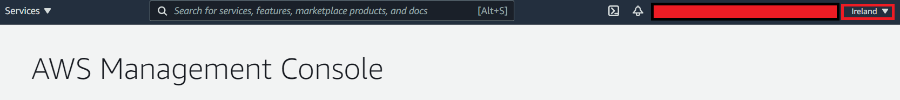
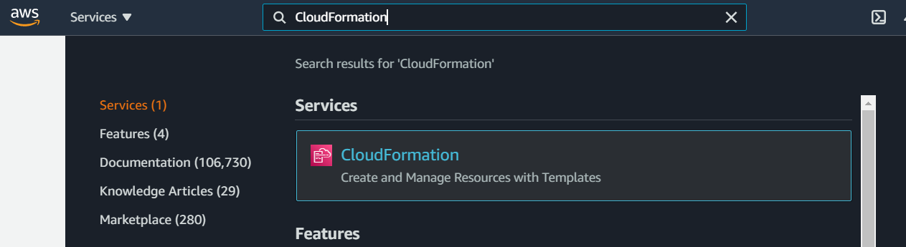
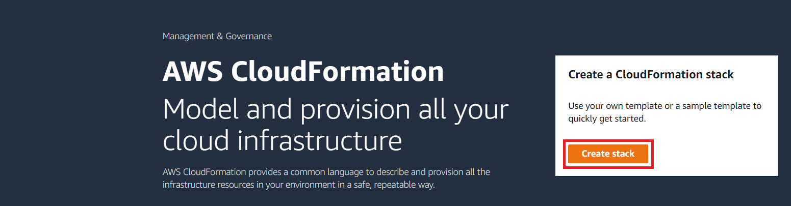
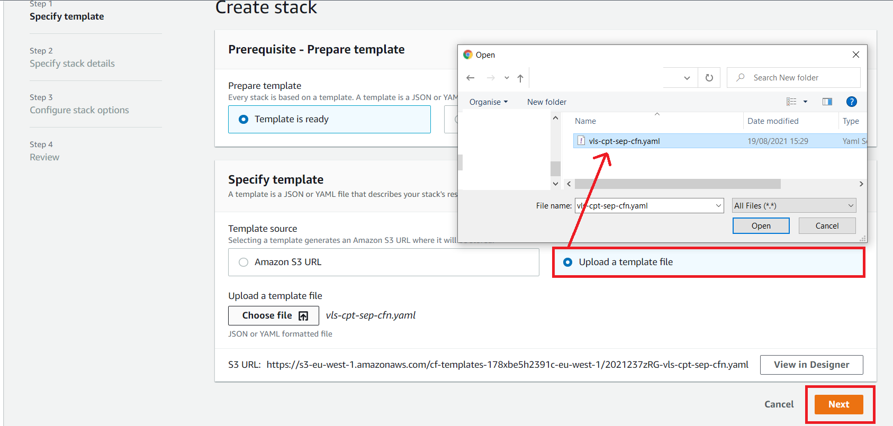
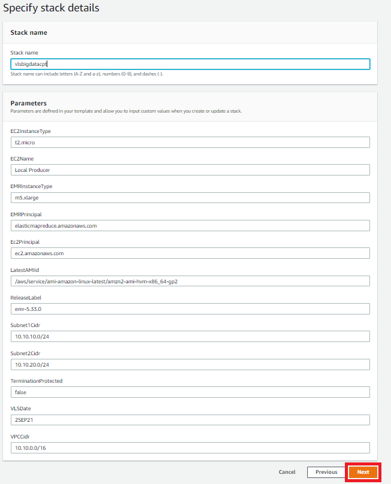
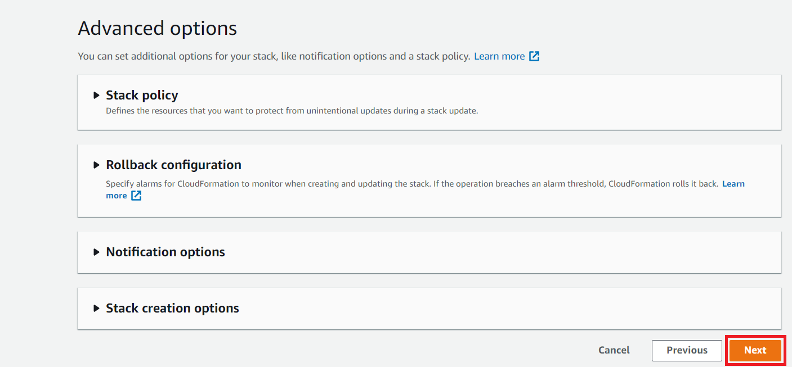
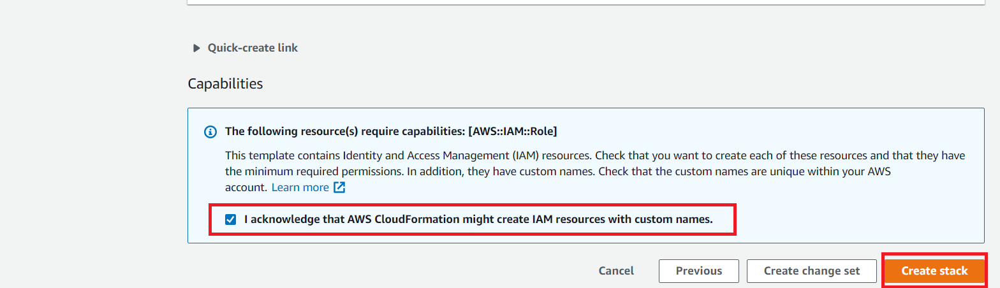
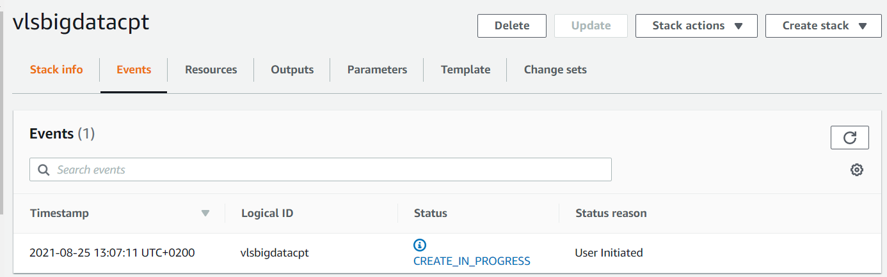

# Environment setup

1. Switch the region to eu-west-1 - Ireland.

2. Download the CloudFormation template [here](https://raw.githubusercontent.com/sobeyd/VLS_march_2022/main/Day1/CloudFormationTemplate.yaml).
3. Search for CloudFormation on the service list.

4. Select "Create stack".

5. Select the template downloaded in step 2 above and click Next.

6. Provide the stack a name (vlsbigdatacpt) as below. Do not change the parameters section and click Next.

7. Scroll down and click Next.

8. Acknowledge the creation of IAM Roles and create the stack.

9. Environment creation is initiated.

