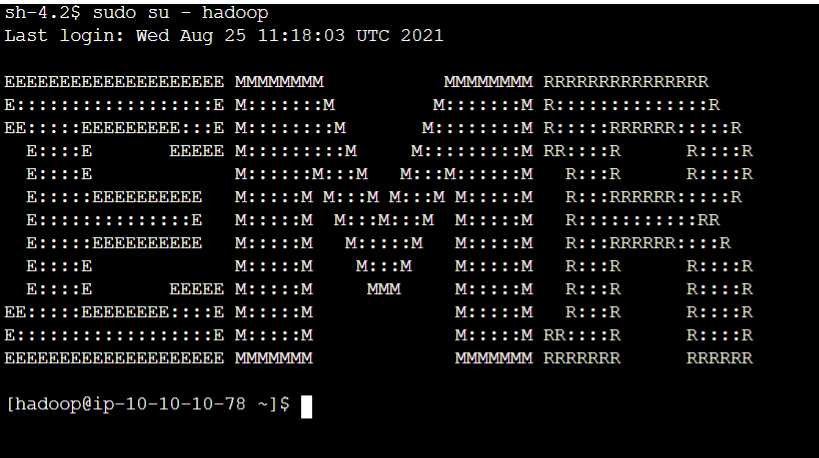

# Running HDFS commands

## Part 1: Login to EMR cluster master node using Session Manager

1. First navigate to the Hardware tab on the EMR Console page for your cluster.
2. Click on the Master instance group ID.

3. Click on the instance ID of the Master node.

4. Select the instance and then click on Connect at the top of the EC2 page.

5. Click on Session Manager, click Connect

6. Once the session loads, run `sudo su - hadoop` to switch to the hadoop user and to navigate to the hadoop user's home directory.

