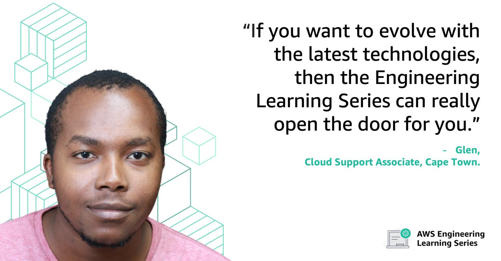

# VLS march 2022

# Building integrated ETL tools, Hadoop and Machine Learning solutions on AWS

## An AWS Learning and Recruiting Event

We look forward to seeing you there!

28, 29 March and 1 April, 2022

6PM - 9PM SAST

## About

Are you interested in learning how to start a career at AWS? Or finding out what it takes to be successful in the interview process with us? How about the culture at AWS?

You will learn these things and more during our virtual recruiting event.

## Topics covered will include:

An introduction to Cape Town AWS Premium Support - Big Data Team

An introduction to the ETL tools available on AWS

An introduction to the Hadoop framework and its use in scalable distributed data processing in the cloud

An introduction to Machine Learning tools and frameworks to help scale your Data Science workloads

The aim of this virtual recruiting event is to offer a free industry workshop to professionals who are open to learning more about a career with AWS. Following the event, you may even be invited to interview for a role with AWS Premium Support in Cape Town.

This event is specially tailored to benefit individuals who wrestle with large datasets, and constantly innovate to ensure we can keep up with the data explosion. Technical competencies we value and which are required in order to register for the event:

- Systems Administration (Linux)
- Distributed Systems
- Database Administration
- Coding/Programming
- Related Industry experience

Please note that registration for this event is required. Once your registration has been reviewed by a member of the AWS Learning Series team, we’ll send you an RSVP confirmation email with event log-in information.

Please note, you must receive a confirmation email in order to attend.

